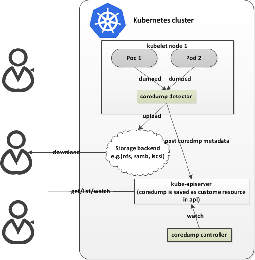

# coredump detector add-on

Cao Shufeng (@CaoShuFeng)

## Abstract

This proposal aims at managing coredump files generated in cluster containers.

## Motivation and Goals

Application coredump is one of required feature for enterprise systems. In Kubernetes, we need to take "multi-tenancy" and "security" into account. Technically, under Linux, each server’s coredump can be controlled via [/proc/sys/kernel/core_pattern](http://man7.org/linux/man-pages/man5/core.5.html) of the host. By this, an application coredump can be passed into host’s special file or special program. We need to build API to specify
  - Where coredumps should be stored and access control to them
  - typically, namespaced persistent storage rather than host’s file system
  - list/get/delete coredump metadata
  - access control to dumped data
  - quota for coredump for each namespace
  - no core dump label for specific environment (such as development environ)

## Non-Goals
This project amis to support access control to coredump files generated from local Linux namespace isolated container runtimes, like docker, rkt. Hypervisor-based container runtime like frakti and container runtimes use other implementations for pod isolation are not considered.

## Community Work

- make core_pattern support namespace in kernel (not approved yet): https://lkml.org/lkml/2017/2/7/931

## Proposed Design

To implement this, we need to make the following components run in kubernetes cluster:
1. A coredump-detector daemonset runs in each node. It will:
   * put a new special program integrated with kuberentes’s API into /proc/sys/kernel/core_pattern
   * determine process in which pod/namespace generated the core file
   * save coredump metadata into api-server
   * save coredump file into persistent volume
2. A coredump-controller which support quota of coredump files in each namesapce


# core_pattern
To determine whether a core file is generated for process in a k8s container, we
override /proc/sys/kernel/core_pattern kernel parameter in kubelet node.
```
|/coredump/coredump-detector -P=%P -p=%p -e=%e -t=%t -c=/coredump/config --log_dir=/coredump/
```

When coredump happens, linux kernel will call coredump-detector and give core
dump file as standard input to coredump-detector.
coredump-detector will:
* access the container runtime service and distinguish where(which container) the core dump comes from
* access the kubernetes cluster and distinguish which namespace this pod belongs to
* register the coredump metadata to api-server
* save core dump file to local host cache

# custom resource definition
CustomResourceDefinition (CRD) is a built-in API of kubernetes that offers a simple way
to create custom resources. We created [two CRDs](https://github.com/CaoShuFeng/coredump-detector/blob/master/yaml/coredump-crd.yaml) to save our own
custom resource into the key-value storage, `coredumps` and `coredumpquotas`.
`coredumps` stores the metadata of coredump files:
```go
type Coredump struct {
        metav1.TypeMeta   `json:",inline"`
        metav1.ObjectMeta `json:"metadata"`
        Spec              CoredumpSpec   `json:"spec"`
        Status            CoredumpStatus `json:"status,omitempty"`
}

type CoredumpSpec struct {
        ContainerName string    `json:"containerName"`
        Pod           string    `json:"pod"`
        Uid           types.UID `json:"uid"`
        Pid           int       `json:"pid"`
        Filename      string    `json:"filename"`
        // Time is the kernel time when coredump happens.
        Time metav1.Time `json:"dumptime"`
        // Volume is the persistent volume, where coredump file is saved.
        Volume string `json:"volume"`
        // Size of coredump file
        Size *resource.Quantity `json:"size"`
}

type CoredumpStatus struct {
        State   CoredumpState `json:"state,omitempty"`
        Message string        `json:"message,omitempty"`
}
```

`coredumpquotas` defines the quota of coredump in each namespace:
```go
type CoredumpQuota struct {
        metav1.TypeMeta   `json:",inline"`
        metav1.ObjectMeta `json:"metadata"`
        Spec              QuotaSpec   `json:"spec"`
        Status            QuotaStatus `json:"status"`
}

type QuotaSpec struct {
        Hard *resource.Quantity `json:"hard"`
}

type QuotaStatus struct {
        Used *resource.Quantity `json:"used"`
        Hard *resource.Quantity `json:"hard"`
}
```

# coredump-controller
Now CRD in kubernetes doesn't support quota, so we deploy a controller to work as
quota admission controller. When a new coredump is registered in the apiserver,
coredump-controller will check the size of coredump. If total size of coredumps
exceeds the quota, the coredump file will not be saved to persistent volume.

# daemonset
daemonset runs in each kubelet node. It mounts a kubernetes persistent volume and
moves coredump file to the volume. If coredump-controller mark a coredump as `Allowed`
in apiserver,daemonset will save the coredump file into the persistent volume. 
Otherwise, the coredump file will dropped from node local cache.

## demonstrate
A demonstrate for this design has been implemented and put [here](https://github.com/CaoShuFeng/coredump-detector).
